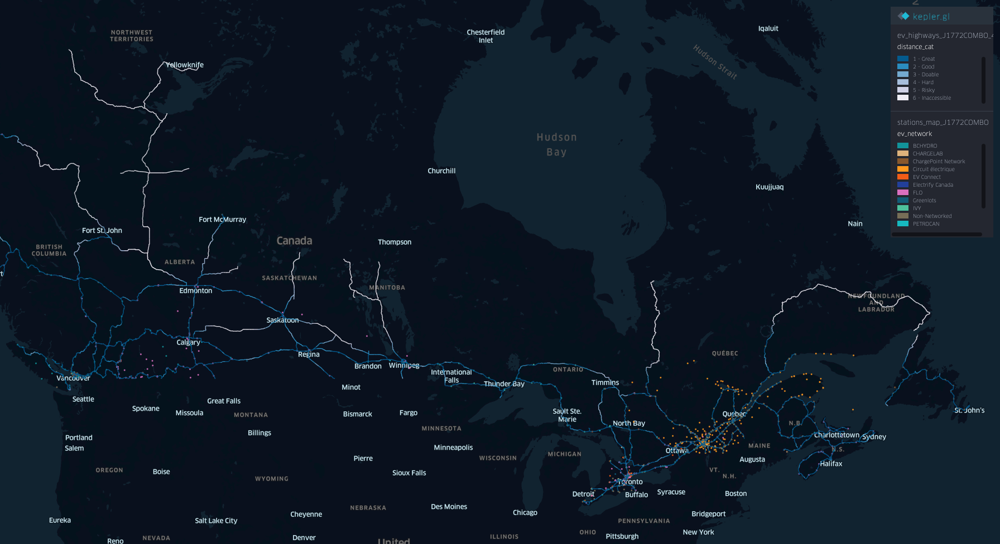

# canada-ev-map

Analyzing Canada's highways for EV accessibility.

Loads the highway system maps and EV fast chargers and determines which highways are traversable by EV.

## Interactive Map

An interactive version of the map running in Kepler.gl is also [available](https://canadianveggie.github.io/canada-ev-map/).

## Running locally

You need to have python installed locally.

`make install`
`make jupyter`

This will open up a Jupyter notebook that will run and analyze the data.

## Creating an animated gif

`make gifs`

